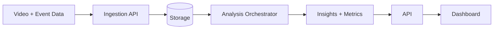
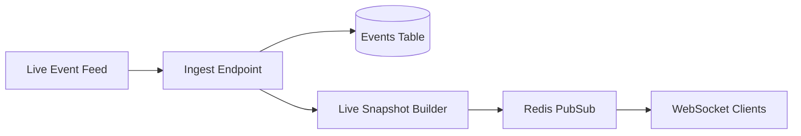

# Architecture

SkyBlueAI is composed of three primary layers:

1. Ingestion and storage (video, events, tracking)
2. Analytics pipeline (CV/ML + heuristics)
3. Delivery (API + dashboard)

## Data Flow

## Real-Time Flow

## Key Services
- `app/services/ingestion.py` handles uploads and storage paths.
- `app/services/analysis.py` generates MVP insights (deterministic heuristics).
- `app/services/injury.py` provides risk scoring.
- `app/services/setpiece.py` returns set-piece routines.
- `app/services/tactical.py` returns tactical recommendations.

## Extensibility
Replace the heuristic modules with real ML/CV models using the same function signatures.
